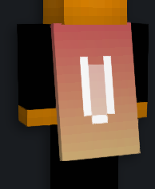

With [Capes](https://modrinth.com/mod/capes), which is included in Additive, you can get a free themed cape of any choice. People using the Capes mod, for example, Fabulously Optimized users, and other Additive users can see this cape. You can also view capes from other sources, such as OptiFine.

## Instructions to apply any cape

1. [Sign up/sign in](https://minecraftcapes.net/account/register) to MinecraftCapes
2. [Draw a cape and download it](https://minecraftcapes.net/gallery/cape-editor), or download either variants of the pre-made Additive cape: ([additive-cape.png](/additive-cape.png) or [additive-cape-simple.png](/additive-cape.png)) (right click image, save as)
3. [Upload your chosen cape](https://minecraftcapes.net/upload-cape) to MinecraftCapes
4. Open Minecraft with Additive installed
5. View your cape in-game! Anyone with Additive, Fabulously Optimized or others using the Capes mod can see it

## Preview

| Normal                                                                          | Simple                                                                                 |
| ------------------------------------------------------------------------------- | -------------------------------------------------------------------------------------- |
|  |  |
